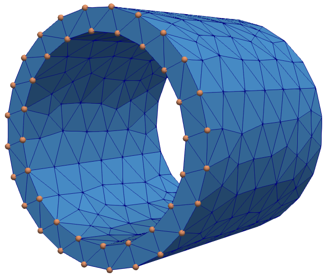

# MeshTutor.jl

Bundle of tutorials for `MeshSteward` and the core mesh library `MeshCore`.



## Installation

Clone the package to your working directory:
```
git clone https://github.com/PetrKryslUCSD/MeshTutor.jl.git
```

## Usage

Change your working directory to `MeshTutor`. Start Julia and run
the following:
```
using Pkg; Pkg.activate("."); Pkg.instantiate()
```

Note that it is possible to generate a Markdown version of the tutorials, which render nicely the code and the accompanying text by running the file `make.jl` as
```
cd("tutorials")
include("make.jl")
```
For instance Google Chrome is capable of displaying such markdown files quite well.

In general the tutorials require the folder `MeshTutor.jl/tutorials` to be the working directory since the scripts assume that the input files will be found in the current directory. So to run a tutorial, do
```
cd("tutorials")
```
open the tutorial file and execute it either in its entirety or line by line. 

## Note

Please note that the tutorials may interfere with each other. Make sure to start a new Julia for each tutorial you wish to execute.
